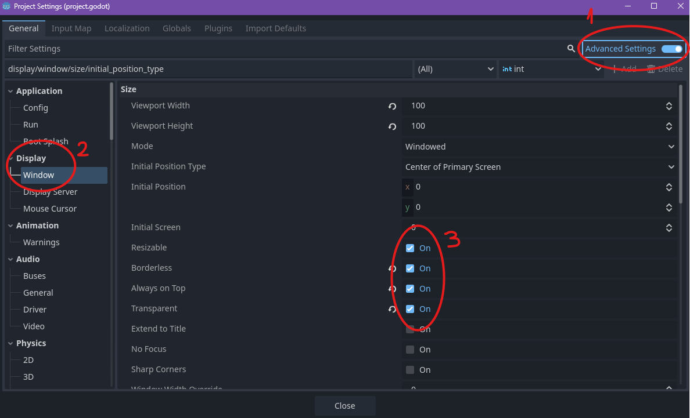
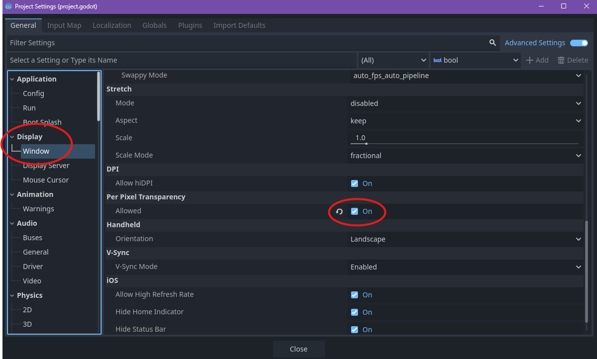
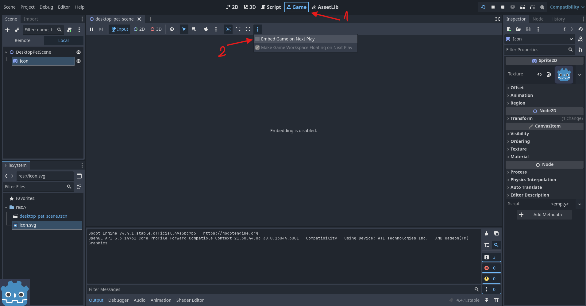
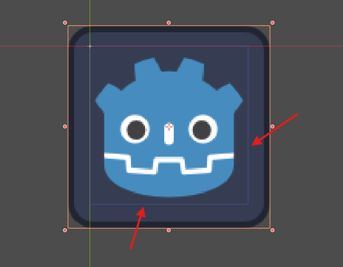
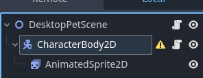
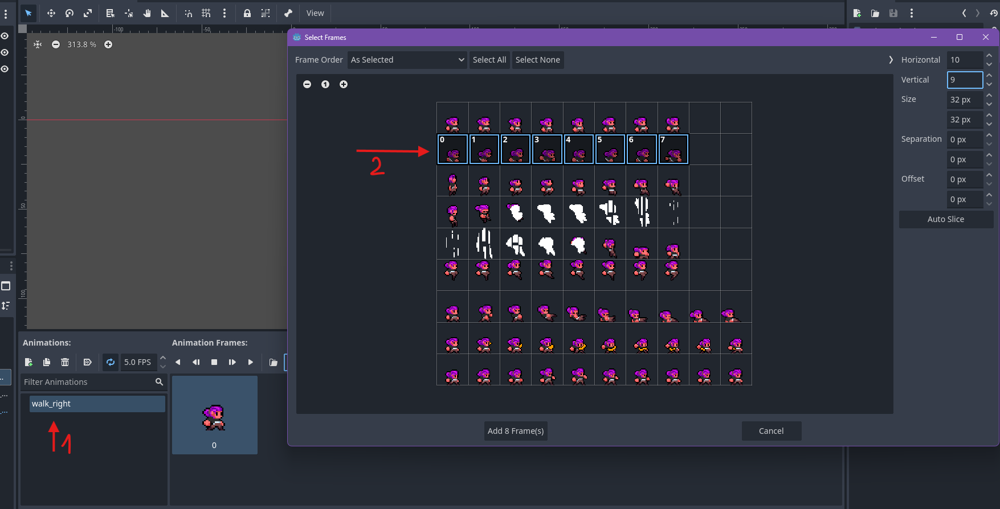

# Creating your own desktop pet :)

## STEP 1 - creating a transparent window
For this step I consulted this tutorial (https://www.youtube.com/watch?v=VUf4TBDTYm4&ab_channel=NADLABS) + an additional step.

1. Create a 2D scene and save it

2. Drag any image in the scene (I used the godot icon.svg that comes with any new project)

3. Go to Project Setting and make sure Advanced Settings are activated

4. In Display -> Window activate resizable, borderless, always on top, transparent and per pixel transparency





5. In Game tab, click on the 3 dots menu and disable "Embed game on next play"



Now you can hit play. Select the current scene and you should see your transparent window. You can change its size from Project Settings->Display->Window->Viewport Width & Height. Make sure that your image is in the purple border of your viewport like so:




## STEP 2 - using a character sprite and making it move
For this step I consulted this tutorial (https://www.youtube.com/watch?v=kw1iI69kW6o&t=957s&ab_channel=CodeWithRo)

1. Replace your from the scene with a CharacterBody2D

2. Add a AnimatedSprite2D to the Character



3. Add a Sprite Frame to the AnimatedSprite2D and click on the Sprite Frame to open the animation menu

4. Click on the default animation and rename it to "walk_right" or any other desired name. 

5. Click on "add frames from spritesheet" (or hit ctrl+shift+o)

6. Select your desired spritesheet (you can find the one I used in the assets folder of this project)

7. Make sure to change the horizontal and vertical to fit the number of rows and columns of your spritesheet

8. Click and drag to select all the frames for the walking right animation in the correct order

9. Add the frames



10. Add a script to your scene to make the window move:

    ```
    extends Node2D

    func _physics_process(delta: float) -> void:
        if Input.is_action_pressed("ui_right"):
            get_window().position.x += 2
        if Input.is_action_pressed("ui_left"):
            get_window().position.x -= 2
    ```

11. Add a script to your character to play the animation when moving. Make sure to use the name of your animation:

    ```
    extends CharacterBody2D
    @onready var _Sprite = $AnimatedSprite2D

    func _process(delta: float) -> void:
        if Input.is_action_pressed("ui_right"):
            _Sprite.flip_h = false
            _Sprite.play("walk_right")
        elif Input.is_action_pressed("ui_left"):
            _Sprite.flip_h = true
            _Sprite.play("walk_right")
        else:
            _Sprite.play("idle")
    ```


12. Hit play and enjoy :). You can reposition the window from Project Settings->Display->Window->Initial Position

## Author
Lorena Cocora